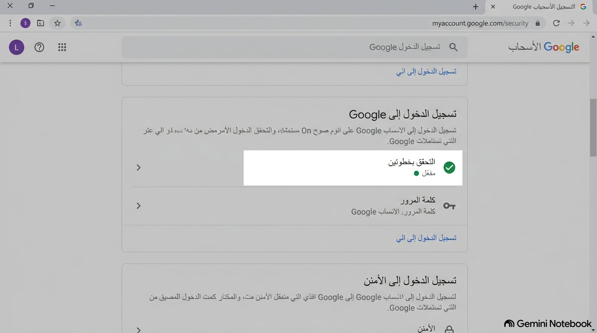
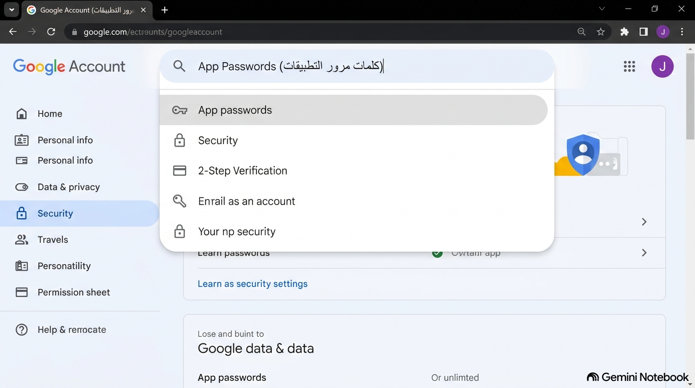
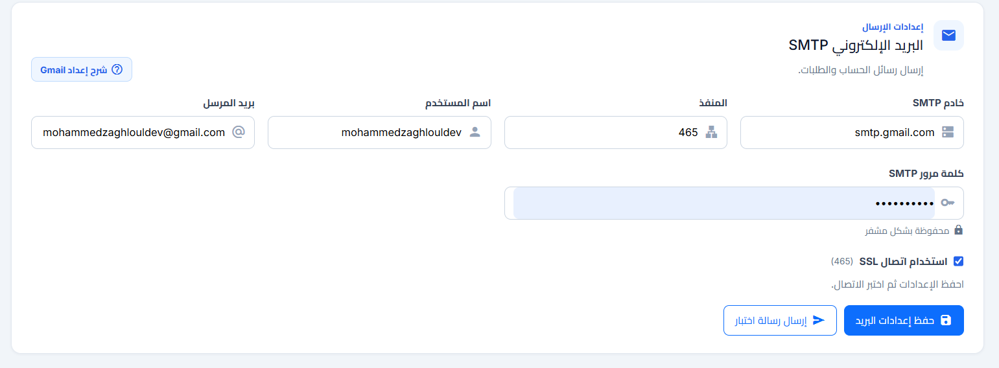

# دليل إعداد Gmail SMTP وكلمة مرور التطبيق (App Password)

> **تنبيه أمني هام:** يتطلب إعداد خادم Gmail SMTP استخدام **App Password** مكونة من 16 حرفاً بدلاً من كلمة المرور العادية للحساب، وذلك لتعزيز الأمان وحماية بياناتك.

[← العودة إلى إعدادات الإرسال](/admin/settings)

## الخطوة 1: تفعيل التحقق بخطوتين (2-Step Verification)

قم بالدخول إلى حساب Google الخاص بك، وانتقل إلى قسم **Security (الأمان)**. قم بتفعيل ميزة **2-Step Verification** إذا لم تكن مفعلة لديك، حيث أن خيار كلمة مرور التطبيق لا يظهر بدونها.

## الخطوة 2: الوصول إلى كلمات مرور التطبيقات (App Passwords)

في شريط البحث داخل صفحة الأمان، اكتب `App Passwords` واضغط على النتيجة للوصول المباشر للشاشة.

## الخطوة 3: توليد كلمة المرور الخاصة بالتطبيق

اكتب اسم التطبيق (مثل: *App SMTP*)، ثم اضغط على **Create (إنشاء)**. سيظهر لك كود أمني مكون من 16 حرفاً. قم بنسخه لاستخدامه ككلمة مرور لخادم الإرسال.

## الخطوة 4: إدخال البيانات في واجهة إعدادات البريد

أدخل البيانات التالية في صفحة إعدادات البريد الإلكتروني في تطبيقك، ثم اضغط **حفظ إعدادات البريد** وأرسل رسالة اختبار:

| الإعداد | القيمة المطلوبة | ملاحظات |
|---|---|---|
| SMTP Server | `smtp.gmail.com` | عنوان خادم Gmail المعتمد |
| Port (المنفذ) | `587` أو `465` | المنفذ 587 يستخدم تشفير STARTTLS (موصى به)، والمنفذ 465 يستخدم SSL |
| Username | `your-email@gmail.com` | عنوان بريدك الإلكتروني الكامل |
| Password | `xxxx xxxx xxxx xxxx` | كلمة مرور التطبيق المكونة من 16 حرفاً (وليس كلمة مرورك الشخصية) |

## ملاحظات مهمة

- عند تغيير كلمة مرور حساب Google الرئيسية مستقبلاً، يتم **إبطال كلمات مرور التطبيقات تلقائياً**، وستحتاج إلى إنشاء App Password جديدة وإدخالها في الإعدادات من جديد.
- إذا ظهر خطأ تسجيل الدخول (5.7.0 Authentication Required): أنشئ App Password جديدة، وتأكد من إدخال بريد Gmail كاملاً (مثل `store@gmail.com`)، واستخدم `587 + STARTTLS` أو `465 + SSL`.
